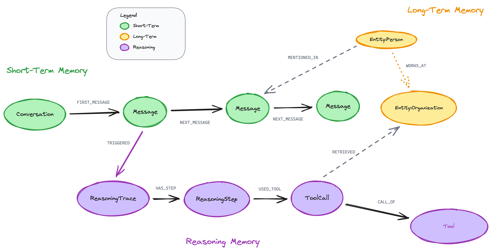

# Neo4j Agent Memory

A graph-native memory layer for AI agents, backed by Neo4j.

It combines three complementary memory lanes:

- `Short-term`: task or conversation history
- `Long-term`: durable facts, preferences, and entities
- `Reasoning`: traces, tool usage, and reusable outcomes

The project can be used as a Python library, an MCP server, or a shell-first CLI.
The current coding-agent workflow is now stable enough to support task-scoped
sessions, startup recall, review-first durable writes, and explicit durable
supersession.

[](https://neo4j.com/labs/)
[](https://neo4j.com/labs/)
[](https://community.neo4j.com)
[](https://github.com/neo4j-labs/agent-memory/actions/workflows/ci.yml)
[](https://badge.fury.io/py/neo4j-agent-memory)
[](https://pypi.org/project/neo4j-agent-memory/)
[](https://opensource.org/licenses/Apache-2.0)

## What It Does



| Layer | Purpose | Typical content |
|---|---|---|
| Short-term | active run history | messages, session-local observations |
| Long-term | durable reusable knowledge | facts, preferences, entities |
| Reasoning | reusable task traces | steps, tool calls, outcomes |

Neo4j Agent Memory also supports entity extraction, relationship extraction,
deduplication, enrichment, framework integrations, and MCP-based usage for
assistant hosts.

## Coding-Agent V1

The coding-agent workflow now has a clear operational contract:

- one `session_id` per active coding task
- selective short-term writes instead of noisy full logs
- review-first durable writes for facts, preferences, and curated entities
- coding-oriented startup recall via `CodingAgentMemory.get_startup_recall()`
  and `neo4j-agent-memory memory recall`
- durable supersession that keeps metadata status and explicit
  `SUPERSEDED_BY` graph edges for facts and preferences

For the shell-first workflow, start with the local skill:

- [Agent Memory skill](skill/agent-memory/SKILL.md)
- [Coding agent workflow example](examples/coding_agent_workflow.py)
- [Coding-agent usage model](.spark_utils/data/20260410_coding_agent_usage_model.md)

## What V2 Will Add

V2 is intended to make the memory model more graph-native and less ambiguous,
without giving up the current V1 safety guarantees.

The main directions are:

- explicit provenance edges from durable memories to messages, traces, or tool calls
- stronger links from reasoning traces to the durable outcomes they produced
- richer entity semantics and more reliable reviewed relation ingestion
- optional persistence of long-term candidates and review history
- tighter write policy and retrieval quality before any broader automation

What remains intentionally out of scope for now:

- aggressive auto-promotion from short-term to long-term
- broad LLM fallback everywhere
- graph expansion without strong provenance

Roadmap note:

- [V2 roadmap and assumptions](.spark_utils/ideas_and_assumptions/20260414_agent_memory_v2_roadmap.md)

## Choose A Surface

### Python API

Use the native client when you want direct programmatic control:

```python
from neo4j_agent_memory import MemoryClient, MemorySettings
```

For task-scoped coding workflows, prefer:

```python
from neo4j_agent_memory import CodingAgentMemory
```

Key references:

- [Getting started](docs/modules/ROOT/pages/getting-started.adoc)
- [MemoryClient API](docs/modules/ROOT/pages/reference/api/memory-client.adoc)
- [Short-term API](docs/modules/ROOT/pages/reference/api/short-term.adoc)

### Shell-First CLI

Use the `memory` command group when you want a real operational workflow from
the terminal:

```bash
neo4j-agent-memory memory --local-embedder <command> ...
```

For coding work, the core commands are:

- `session-id`
- `recall`
- `add-message`
- `start-trace`
- `add-trace-step`
- `add-tool-call`
- `complete-trace`
- `add-fact`
- `add-preference`
- `add-entity`
- `replace-fact`
- `replace-preference`
- `update-entity`
- `alias-entity`
- `merge-entity`
- `inspect`
- `search`
- `get-context`

Reference:

- [CLI reference](docs/modules/ROOT/pages/reference/cli.adoc)

### MCP Server

Use the MCP server when you want Neo4j-backed memory exposed as tools to
Claude Desktop, Claude Code, Cursor, VS Code Copilot, or another MCP host.

Reference:

- [MCP tools reference](docs/modules/ROOT/pages/reference/mcp-tools.adoc)

## Installation

```bash
pip install neo4j-agent-memory
pip install neo4j-agent-memory[cli]
pip install neo4j-agent-memory[mcp]
pip install neo4j-agent-memory[all]
```

Package setup and optional extras are described in:

- [Getting started](docs/modules/ROOT/pages/getting-started.adoc)
- [Reference index](docs/modules/ROOT/pages/reference/index.adoc)

## Examples

This repository includes both general examples and coding-agent-specific ones.

Highlighted examples:

- [Coding Agent Workflow](examples/coding_agent_workflow.py)
- [Coding Agent Smoke Test](examples/coding_agent_smoke_test.py)
- [Examples overview in the docs](docs/modules/ROOT/pages/index.adoc)

## Documentation

Local docs entry points:

- [Docs home](docs/modules/ROOT/pages/index.adoc)
- [Getting started](docs/modules/ROOT/pages/getting-started.adoc)
- [How-to guides](docs/modules/ROOT/pages/how-to/index.adoc)
- [Reference index](docs/modules/ROOT/pages/reference/index.adoc)
- [FAQ](docs/modules/ROOT/pages/faq.adoc)

Published documentation:

- [neo4j.com/labs/agent-memory](https://neo4j.com/labs/agent-memory/)

## Framework Integrations

The project includes integrations for multiple agent frameworks and runtimes,
including LangChain, Pydantic AI, Google ADK, Strands, CrewAI, LlamaIndex,
OpenAI Agents, and Microsoft Agent.

Reference:

- [Integration docs](docs/modules/ROOT/pages/how-to/integrations/index.adoc)

## Acknowledgements 💜

This repository builds on prior open-source work.

- It is forked from the original Neo4j Labs `agent-memory` repository and
  continues from that foundation for the current workflow and product direction.
- Several coding-memory concepts, especially around startup recall, durable
  knowledge discipline, and trajectory-informed reuse, were shaped by ideas
  explored in `voidm`.

References:

- 💪 `neo4j-labs/agent-memory`: https://github.com/neo4j-labs/agent-memory
- 🚀 `autonomous-toaster/voidm`: https://github.com/autonomous-toaster/voidm

## Development

```bash
git clone https://github.com/neo4j-labs/agent-memory.git
cd agent-memory/neo4j-agent-memory
uv sync --group dev
make test-unit
make check
```

For repo-local coding usage, the practical workflow is described in the skill
and examples rather than in this README:

- [Agent Memory skill](skill/agent-memory/SKILL.md)
- [Coding Agent Workflow](examples/coding_agent_workflow.py)
